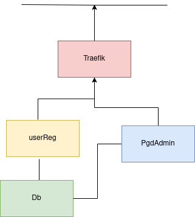

# UserRegAPI
# How to launch 
## Live Developement
Its basiclly on DEV mode with the docker-compose.overrive.yml


```console
sudo docker compose up 
```
# Architecture
## Traefik
Proxy technologie used to handle request
## UsreReg
The Restful APi mainly fastapi
## DB
a postgres db
## PgAdmin
A dedicated application to interact with Pgadmin
to connect  : 
<br>PGADMIN_DEFAULT_EMAIL=userapi@ippf.com
<br>PGADMIN_DEFAULT_PASSWORD=a0c85c31f5
<br>


